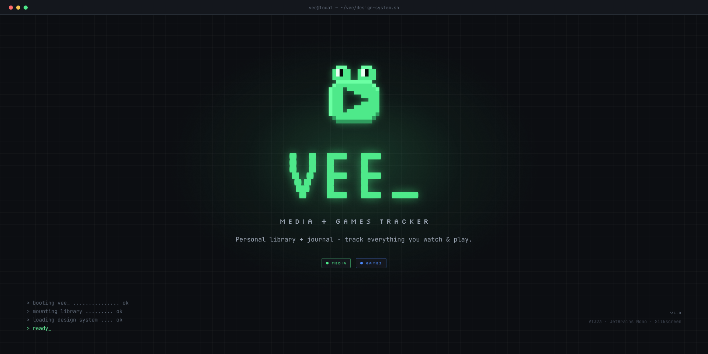

<p align="center">
  
</p>

<h4 align="center">A local-first desktop app to track and journal your media & games library, Playnite-inspired and wrapped in a retro CRT aesthetic. Built with <a href="https://tauri.app/" target="_blank">Tauri</a> and <a href="https://nextjs.org/" target="_blank">Next</a>.</h4>

<p align="center">
  <a href="#about">About</a> •
  <a href="#setup">Setup</a> •
  <a href="#production">Production</a> •
  <a href="#architecture">Architecture</a> •
  <a href="#tools">Tools</a> •
  <a href="#author">Author</a>
</p>

## About

- A personal library and journal for two domains that share one space: **Media** (series, films, podcasts, video series) with progress tracking, and **Games**, a launcher-style collection where each title is **Native** or **Emulated**.
- 100% **local and offline**: no login, no server. It lives on your machine in a frameless, draggable desktop window.
- Per-domain states: Media flows through Watching / Backlog / Completed / Dropped / Archived; Games are Installed / Archived.
- Retro **terminal / CRT** aesthetic: blueprint grid, a phosphor glow that follows your cursor, pixel display type, and an animated boot splash on every launch.
- **Per-domain theming**: the accent swaps phosphor green (Media) and azure (Games) through a single `data-domain` switch, and both colors are meant to be customizable.
- Structured following the Atomic Design methodology over a strict, one-way layered architecture.

## Setup

- Follow the usual flow of a Tauri + Next.js project.
- Node version 20 or above, plus the [Rust toolchain](https://www.rust-lang.org/tools/install) (Tauri's prerequisites). On Windows you also need WebView2 (preinstalled on Windows 11).
- Run (`npm install`) to install the packages.
- Use (`npm run dev`) to launch the desktop app in development (Tauri and Next.js together).
- Prefer the browser? (`npm run dev:next`) runs just the Next.js frontend on port 3000.

## Production

Build the native app and installer for your current platform:

```bash
npm run tauri build
```

The artifacts are written to `src-tauri/target/release/bundle/` (for example, the Windows `-setup.exe` / `.msi`).

## Architecture

- **Entry** (`src/app`): a thin route layer (App Router, static export). A `(shell)` route group provides the window chrome to every screen.
- **Features** (`src/modules/*`): self-contained vertical slices, `shell` (title bar, boot screen, navigation), `media`, and `games`.
- **Core** (`src/core`): domain layer and the design system tokens (`core/assets/styles`, split into colors / effects / theme / utilities / animations).
- **Shared** (`src/shared`): cross-feature primitives such as the `PlayMark` brand mark and the `GridBackground`.
- Components follow **Atomic Design** (atoms → molecules → organisms → pages) with co-located `.hook` / `.types` files, nested `subcomponents/`, and barrel exports, so dependencies flow one way (entry → features → core).

## Tools

This application uses the following open-source packages:

##### Core ones.

- [Tauri](https://tauri.app/) (Desktop shell and native runtime)
- [Next](https://nextjs.org/) (Framework, App Router with static export)
- [React](https://react.dev/) (UI library)
- [TypeScript](https://www.typescriptlang.org/) (Strongly typed programming language that builds on JavaScript)

##### Stylization.

- [Tailwind CSS](https://tailwindcss.com/) (Utility-first CSS framework, with a token-driven design system)

##### Code formatter, and other environment development tools.

- [ESLint](https://eslint.org/) (Javascript [linter](https://sourcelevel.io/blog/what-is-a-linter-and-why-your-team-should-use-it))

## Author

**made by niloodev | Ezequiel Nilo**

Distributed under the **MIT** license. See [`LICENSE`](./LICENSE) for more details.

**ANY TIPS OR FEEDBACK IS HIGHLY APPRECIATED! 🐸**

---
